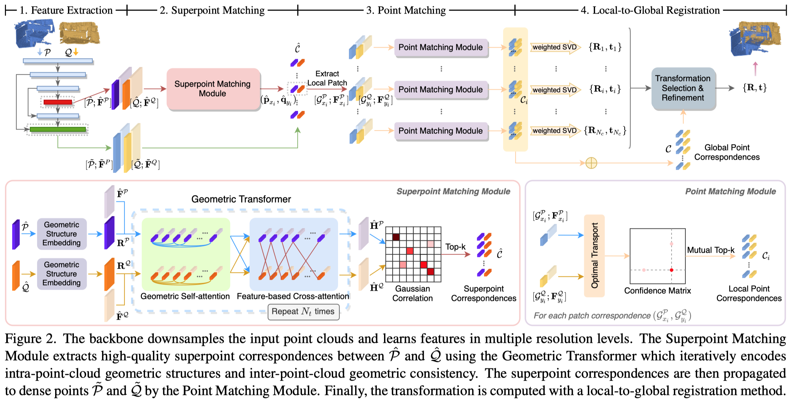

# Geometric Transformer for Fast and Robust Point Cloud Registration

PyTorch implementation of the paper:

[Geometric Transformer for Fast and Robust Point Cloud Registration](https://arxiv.org/abs/2202.06688).

[Zheng Qin](https://scholar.google.com/citations?user=DnHBAN0AAAAJ), [Hao Yu](https://scholar.google.com/citations?user=g7JfRn4AAAAJ), Changjian Wang, [Yulan Guo](https://scholar.google.com/citations?user=WQRNvdsAAAAJ), Yuxing Peng, and [Kai Xu](https://scholar.google.com/citations?user=GuVkg-8AAAAJ).

## Introduction

We study the problem of extracting accurate correspondences for point cloud registration. Recent keypoint-free methods bypass the detection of repeatable keypoints which is difficult in low-overlap scenarios, showing great potential in registration. They seek correspondences over downsampled superpoints, which are then propagated to dense points. Superpoints are matched based on whether their neighboring patches overlap. Such sparse and loose matching requires contextual features capturing the geometric structure of the point clouds. We propose Geometric Transformer to learn geometric feature for robust superpoint matching. It encodes pair-wise distances and triplet-wise angles, making it robust in low-overlap cases and invariant to rigid transformation. The simplistic design attains surprisingly high matching accuracy such that no RANSAC is required in the estimation of alignment transformation, leading to $100$ times acceleration. Our method improves the inlier ratio by $17\% \sim 30\%$ and the registration recall by over $7\%$ on the challenging 3DLoMatch benchmark.



## News

2022.03.30: Code and pretrained models on KITTI and ModelNet40 release.

2022.03.29: This work is selected for an **ORAL** presentation at CVPR 2022.

2022.03.02: This work is accepted by CVPR 2022. Code and Models on ModelNet40 and KITTI will be released soon.

2022.02.15: Paper is available at [arXiv](https://arxiv.org/abs/2202.06688).

2022.02.14: Code and pretrained model on 3DMatch/3DLoMatch release.

## Installation

Please use the following command for installation.

```bash
# It is recommended to create a new environment
conda create -n geotransformer python==3.8
conda activate geotransformer

# [Optional] If you are using CUDA 11.0 or newer, please install `torch==1.7.1+cu110`
pip install torch==1.7.1+cu110 -f https://download.pytorch.org/whl/torch_stable.html

# Install packages and other dependencies
pip install -r requirements.txt
python setup.py build develop
```

Code has been tested with Ubuntu 20.04, GCC 9.3.0, Python 3.8, PyTorch 1.7.1, CUDA 11.1 and cuDNN 8.1.0.

## Pre-trained Weights

We provide pre-trained weights in the [release](https://github.com/qinzheng93/GeoTransformer/releases) page. Please download the latest weights and put them in `weights` directory.

## 3DMatch

### Data preparation

The dataset can be downloaded from [PREDATOR](https://github.com/prs-eth/OverlapPredator). The data should be organized as follows:

```text
--data--3DMatch--metadata
              |--data--train--7-scenes-chess--cloud_bin_0.pth
                    |      |               |--...
                    |      |--...
                    |--test--7-scenes-redkitchen--cloud_bin_0.pth
                          |                    |--...
                          |--...
```

### Training

The code for 3DMatch is in `experiments/geotransformer.3dmatch.stage4.gse.k3.max.oacl.stage2.sinkhorn`. Use the following command for training.

```bash
CUDA_VISIBLE_DEVICES=0 python trainval.py
```

### Testing

Use the following command for testing.

```bash
# 3DMatch
CUDA_VISIBLE_DEVICES=0 ./eval.sh EPOCH 3DMatch
# 3DLoMatch
CUDA_VISIBLE_DEVICES=0 ./eval.sh EPOCH 3DLoMatch
```

`EPOCH` is the epoch id.

We also provide pretrained weights in `weights`, use the following command to test the pretrained weights.

```bash
CUDA_VISIBLE_DEVICES=0 python test.py --snapshot=../../weights/geotransformer-3dmatch.pth.tar --benchmark=3DMatch
CUDA_VISIBLE_DEVICES=0 python eval.py --benchmark=3DMatch --method=lgr
```

Replace `3DMatch` with `3DLoMatch` to evaluate on 3DLoMatch.

## Kitti odometry

### Data preparation

Download the data from the [Kitti official website](http://www.cvlibs.net/datasets/kitti/eval_odometry.php) into `data/Kitti` and run `data/Kitti/downsample_pcd.py` to generate the data. The data should be organized as follows:

```text
--data--Kitti--metadata
            |--sequences--00--velodyne--000000.bin
            |              |         |--...
            |              |...
            |--downsampled--00--000000.npy
                         |   |--...
                         |--...
```

### Training

The code for Kitti is in `experiments/geotransformer.kitti.stage5.gse.k3.max.oacl.stage2.sinkhorn`. Use the following command for training.

```bash
CUDA_VISIBLE_DEVICES=0 python trainval.py
```

### Testing

Use the following command for testing.

```bash
CUDA_VISIBLE_DEVICES=0 ./eval.sh EPOCH
```

`EPOCH` is the epoch id.

We also provide pretrained weights in `weights`, use the following command to test the pretrained weights.

```bash
CUDA_VISIBLE_DEVICES=0 python test.py --snapshot=../../weights/geotransformer-kitti.pth.tar
CUDA_VISIBLE_DEVICES=0 python eval.py --method=lgr
```

## ModelNet

### Data preparation

Download the [data](https://shapenet.cs.stanford.edu/media/modelnet40_ply_hdf5_2048.zip) and run `data/ModelNet/split_data.py` to generate the data. The data should be organized as follows:

```text
--data--ModelNet--modelnet_ply_hdf5_2048--...
               |--train.pkl
               |--val.pkl
               |--test.pkl
```

### Training

The code for ModelNet is in `experiments/geotransformer.modelnet.rpmnet.stage4.gse.k3.max.oacl.stage2.sinkhorn`. Use the following command for training.

```bash
CUDA_VISIBLE_DEVICES=0 python trainval.py
```

### Testing

Use the following command for testing.

```bash
CUDA_VISIBLE_DEVICES=0 python test.py --test_iter=ITER
```

`ITER` is the iteration id.

We also provide pretrained weights in `weights`, use the following command to test the pretrained weights.

```bash
CUDA_VISIBLE_DEVICES=0 python test.py --snapshot=../../weights/geotransformer-modelnet.pth.tar
```

## Multi-GPU Training

As the point clouds usually have different sizes, we organize them in the *pack* mode. This causes difficulty for batch training as we need to convert the data between *batch* mode and *pack* mode frequently. For this reason, we limit the batch size to 1 per GPU at this time and support batch training via `DistributedDataParallel`. Use `torch.distributed.launch` for multi-gpu training:

```bash
CUDA_VISIBLE_DEVICES=GPUS python -m torch.distributed.launch --nproc_per_node=NGPUS trainval.py
```

Note that the learning rate is multiplied by the number of GPUs by default as the batch size increased. In our experiments, multi-gpu training slightly improves the performance.

## Results

### 3DMatch

We evaluate GeoTransformer on the standard 3DMatch/3DLoMatch benchmarks as in [PREDATOR](https://arxiv.org/abs/2011.13005).

| Benchmark |  FMR  |  IR   |  RR   |
| :-------- | :---: | :---: | :---: |
| 3DMatch   | 98.2  | 70.9  | 92.5  |
| 3DLoMatch | 87.1  | 43.5  | 74.2  |

### Kitti odometry

We evaluate GeoTransformer on the standard Kitti benchmark as in [PREDATOR](https://arxiv.org/abs/2011.13005).

| Benchmark |  RRE  |  RTE  |  RR   |
| :-------- | :---: | :---: | :---: |
| Kitti     | 0.230 |  6.2  | 99.8  |

### ModelNet

We evaluate GeoTransformer on ModelNet with two settings:

1. Standard setting: [0, 45] rotation, [-0.5, 0.5] translation, gaussian noise clipped to 0.05.
2. Full-range setting: [0, 180] rotation, [-0.5, 0.5] translation, gaussian noise clipped to 0.05.

We remove symmetric classes and use the data augmentation in [RPMNet](https://arxiv.org/abs/2003.13479) which is more difficult than [PRNet](https://arxiv.org/abs/1910.12240).

| Benchmark      |  RRE  |  RTE  | RMSE  |
| :------------- | :---: | :---: | :---: |
| seen (45-deg)  | 1.577 | 0.018 | 0.017 |
| seen (180-deg) | 6.830 | 0.044 | 0.042 |

## Testing on your own data

To test on your own data, the recommended way is to implement a `Dataset` as in `geotransformer.dataset.registration.threedmatch.dataset.py`. Each item in the dataset is a `dict` contains at least 5 keys: `ref_points`, `src_points`, `ref_feats`, `src_feats` and `transform`.

We also provide a demo script to quickly test our pre-trained model on your own data in `experiments/geotransformer.3dmatch.stage4.gse.k3.max.oacl.stage2.sinkhorn/demo.py`. Use the following command to run the demo:

```bash
CUDA_VISIBLE_DEVICES=0 python demo.py --src_file=../../data/demo/src.npy --ref_file=../../data/demo/ref.npy --gt_file=../../data/demo/gt.npy --weights=../../weights/geotransformer-3dmatch.pth.tar
```

Change the arguments `src_file`, `ref_file` and `gt` to your own data, where `src_file` and `ref_file` are numpy files containing a `np.ndarray` in shape of Nx3, and `gt_file` is a numpy file containing a 4x4 transformation matrix. Note that you should scale your data to match the voxel size in 3DMatch (2.5cm).

## Citation

```bibtex
@inproceedings{qin2022geometric,
    title={Geometric Transformer for Fast and Robust Point Cloud Registration},
    author={Zheng Qin and Hao Yu and Changjian Wang and Yulan Guo and Yuxing Peng and Kai Xu},
    booktitle={Proceedings of the IEEE/CVF Conference on Computer Vision and Pattern Recognition (CVPR)},
    month={June},
    year={2022},
    pages={11143-11152}
}
```

## Acknowledgements

- [D3Feat](https://github.com/XuyangBai/D3Feat.pytorch)
- [PREDATOR](https://github.com/prs-eth/OverlapPredator)
- [RPMNet](https://github.com/yewzijian/RPMNet)
- [CoFiNet](https://github.com/haoyu94/Coarse-to-fine-correspondences)
- [huggingface-transformer](https://github.com/huggingface/transformers)
- [SuperGlue](https://github.com/magicleap/SuperGluePretrainedNetwork)
